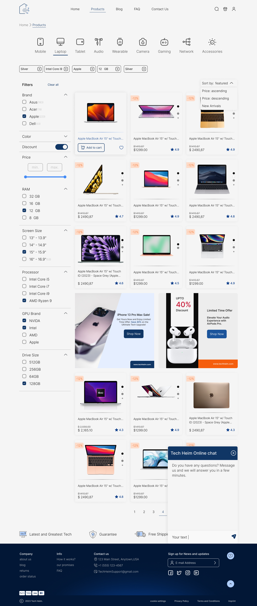
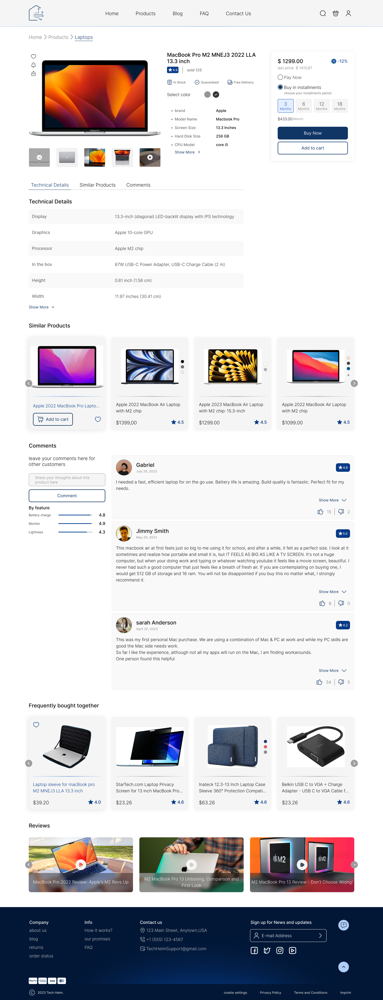
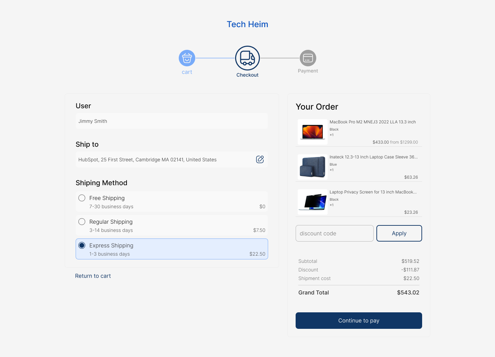

# 🛒 Matager – Backend API (Graduation Project)

This repository showcases the backend API implementation I developed as part of the **Matager Platform**, a graduation project built in collaboration with my team.

> 👨‍💻 **My Role:** Backend Java Developer

---

## 🚀 Project Overview

**Matager** is an innovative e-commerce platform designed to empower individuals and businesses to create and manage their online shops effortlessly.

### 🌟 Platform Highlights:
- ⚡ **Easy Setup:** Create your online store within minutes with a simple and intuitive setup process.
- 🔧 **Comprehensive Control:** Manage products, payment methods, and delivery options with ease.
- 📊 **Analytics Dashboard:** Gain valuable insights into customer behavior, popular items, and regional sales through detailed reports.

---

## 🔧 APIs (Designed & Built by Me)

My Role Includes:

### ✅ Owner/Admin Endpoints
- Designing and implementing the database model.
- Product, Category, Subcategory CRUD
- Order history
- Owner dashboard statistics
- Some Screenshots for the owner's portal:
    
  

  
  
  
  
  
  

### ✅ Store Endpoints
- Product listing, search, and filter
- Wishlist & Cart management
- Order creation & checkout process
- Click tracking for recommendation system
- Some Screenshots for the store:
  

  
  
  
  

---

## 📬 API Testing with Postman

You can view and test all endpoints visually using Postman 👇

> Click the button to open my API collection directly in Postman.

  
## 🔗 Full Project Repository

This backend is part of the complete **Matager Platform**, which includes the frontend and full system architecture.

👉 **Explore the full project here:** [https://github.com/Matager](https://github.com/Matager)
